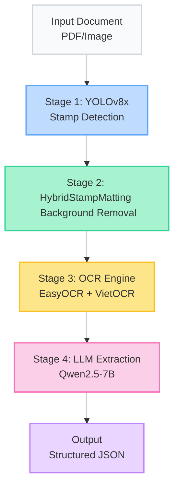
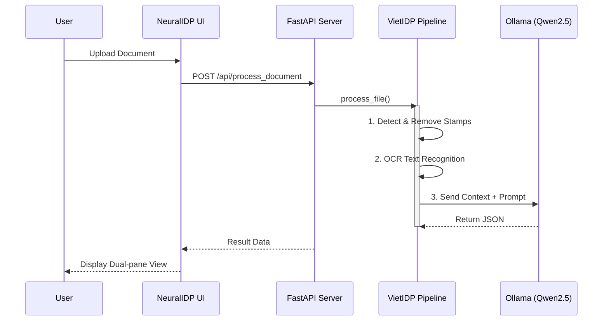

# Nghiên cứu Xây dựng Hệ thống Trích xuất và Cấu trúc hóa Thông tin Tự động từ Văn bản Hành chính Tiếng Việt sử dụng Mô hình Ngôn ngữ Lớn (LLMs) và Công nghệ OCR

**Tác giả:** [Tên tác giả]  
**Đơn vị:** [Tên đơn vị / Trường]  
**Email:** [email]

---

## Tóm tắt (Abstract)

Bài báo trình bày hệ thống **VietIDP (Vietnamese Intelligent Document Processing)** — giải pháp xử lý tài liệu thông minh chạy hoàn toàn offline trên phần cứng cục bộ, kết hợp công nghệ OCR tiên tiến và Mô hình Ngôn ngữ Lớn (LLM) để tự động số hóa, nhận dạng và bóc tách thông tin có cấu trúc từ văn bản hành chính tiếng Việt. Hệ thống tích hợp 5 thành phần chính: (1) YOLOv8x phát hiện vùng con dấu đỏ, (2) HybridStampMatting xóa nhiễu con dấu bằng Color Matting + Background Removal, (3) VietOCR nhận dạng chữ tiếng Việt với kiến trúc VGG-Transformer, (4) Qwen2.5-7B (4-bit quantization) trích xuất thông tin cấu trúc JSON, và (5) ChromaDB hỗ trợ tìm kiếm ngữ nghĩa (RAG). Thử nghiệm quy mô lớn trên tập dữ liệu 100 văn bản hành chính Việt Nam nhiễu cho thấy hệ thống đạt CER 23.54%, F1-score trích xuất ~75%, với thời gian xử lý trung bình 16.89 giây/trang và chỉ tiêu tốn 2.16GB VRAM trên GPU NVIDIA RTX 5070, chứng minh tính khả thi của việc triển khai Edge AI cục bộ tại các doanh nghiệp.

**Từ khóa:** OCR, LLM, NLP, Văn bản hành chính, Trích xuất thông tin, YOLOv8, VietOCR, Qwen2.5, Xử lý tài liệu thông minh

---

## 1. Giới thiệu (Introduction)

### 1.1 Bối cảnh và Động lực nghiên cứu

Trong bối cảnh chuyển đổi số quốc gia, hàng triệu văn bản hành chính giấy (quyết định, công văn, nghị định, thông tư) cần được số hóa và trích xuất thông tin một cách tự động. Tuy nhiên, các giải pháp OCR truyền thống (Tesseract, ABBYY) gặp nhiều hạn chế khi xử lý văn bản tiếng Việt, đặc biệt khi văn bản có nhiễu từ con dấu đỏ, chất lượng scan thấp, và các ký tự đặc thù tiếng Việt (dấu thanh, dấu phụ).

### 1.2 Mục tiêu nghiên cứu

- Xây dựng pipeline E2E xử lý tài liệu hành chính từ ảnh/PDF gốc đến dữ liệu JSON cấu trúc
- Giải quyết bài toán xóa nhiễu con dấu đỏ trong văn bản hành chính Việt Nam
- Tích hợp LLM tinh chỉnh để trích xuất thông tin ngữ nghĩa (loại văn bản, số hiệu, ngày ban hành, cơ quan ban hành, người ký)
- Đảm bảo toàn bộ hệ thống chạy offline trên phần cứng cục bộ (data sovereignty)

### 1.3 Đóng góp chính

1. **HybridStampMatting**: Phương pháp kết hợp Color Matting (HSV) + Background Removal (U2-Net) xóa con dấu đỏ hiệu quả hơn GAN truyền thống
2. **Pipeline 5 giai đoạn**: Kiến trúc module hóa cho phép thay thế từng thành phần độc lập
3. **Sliding Window Chunking**: Kỹ thuật chia văn bản dài thành đoạn paragraph-aware cho LLM context window 32K
4. **NeuralIDP Enterprise**: Web application hoàn chỉnh cho triển khai thực tế

---

## 2. Tổng quan Nghiên cứu liên quan (Related Work)

### 2.1 OCR cho tiếng Việt

| Phương pháp | Ưu điểm | Hạn chế |
|-------------|---------|---------|
| Tesseract OCR | Mã nguồn mở, hỗ trợ nhiều ngôn ngữ | Độ chính xác thấp với tiếng Việt có dấu |
| PaddleOCR | Hiệu năng cao, hỗ trợ đa ngôn ngữ | Cần fine-tune cho tiếng Việt |
| **VietOCR** | Tối ưu cho tiếng Việt, VGG-Transformer | Cần text detection riêng |
| EasyOCR | Tích hợp detection + recognition | Độ chính xác trung bình cho tiếng Việt |

### 2.2 Stamp Removal

- Pix2Pix GAN (Isola et al., 2017): Yêu cầu dữ liệu cặp (paired data), khó tổng quát hóa
- CycleGAN: Không cần dữ liệu cặp nhưng kết quả không ổn định
- **HybridStampMatting (đề xuất)**: Color-based matting + neural background removal, ổn định hơn

### 2.3 LLM cho Information Extraction

- GPT-4: Hiệu năng cao nhưng yêu cầu API cloud, vi phạm bảo mật dữ liệu
- Llama 3: Hỗ trợ tiếng Việt hạn chế
- **Qwen2.5-7B**: Hỗ trợ tiếng Việt tốt, quantization 4-bit chạy được trên GPU 8GB

---

## 3. Phương pháp Đề xuất (Proposed Method)

### 3.1 Kiến trúc Tổng thể




### 3.2 Stage 1: Phát hiện Con dấu — YOLOv8x

- **Architecture**: YOLOv8x (extra large), pretrained COCO → fine-tuned trên 2000 ảnh con dấu Việt Nam
- **Input**: Ảnh gốc (BGR)
- **Output**: Bounding boxes `[x1, y1, x2, y2, confidence]` cho mỗi vùng con dấu
- **Threshold**: confidence ≥ 0.25

### 3.3 Stage 2: Xóa Con dấu — HybridStampMatting

```python
class HybridStampMatting:
    def remove_stamp(self, image, bbox):
        # 1. Crop vùng con dấu theo bbox
        stamp_region = image[y1:y2, x1:x2]
        
        # 2. Color Matting: tạo mask đỏ bằng HSV thresholding
        hsv = cv2.cvtColor(stamp_region, cv2.COLOR_BGR2HSV)
        red_mask = detect_red_hue(hsv)  # H: [0-10] ∪ [170-180]
        
        # 3. Background Removal: Rembg (U2-Net) xóa foreground con dấu
        stamp_alpha = rembg.remove(stamp_region)
        
        # 4. Hybrid merge: kết hợp color mask + neural mask
        final_mask = combine_masks(red_mask, stamp_alpha)
        
        # 5. Inpaint vùng con dấu
        clean = cv2.inpaint(stamp_region, final_mask, 3, cv2.INPAINT_TELEA)
        return clean
```

### 3.4 Stage 3: Nhận dạng Chữ — VietOCR

- **Text Detection**: EasyOCR CRAFT model phát hiện dòng text
- **Text Recognition**: VietOCR (VGG-Transformer) nhận dạng tiếng Việt
- **2-Tier Strategy**: EasyOCR detect → crop → VietOCR recognize (mỗi dòng)

### 3.5 Stage 4: Trích xuất Thông tin — Qwen2.5-7B

- **Model**: Qwen2.5-7B, quantization Q4_K_M (4-bit), chạy qua Ollama
- **Prompt Engineering**: Few-shot examples với 3 loại văn bản mẫu
- **Sliding Window**: Văn bản dài > 32K chars → chia thành chunks paragraph-aware → merge kết quả
- **Output**: JSON cấu trúc {loai_van_ban, so_hieu, ngay_ban_hanh, co_quan_ban_hanh, trich_yeu, nguoi_ky}

---

## 4. Thực nghiệm (Experiments)

### 4.1 Môi trường Thực nghiệm

| Thành phần | Cấu hình |
|-----------|----------|
| CPU | Intel Core i7-14700HX |
| GPU | NVIDIA RTX 5070 (8GB VRAM) |
| RAM | 24 GB DDR5 |
| OS | Windows 11 |
| Runtime | Python 3.10 (Miniconda), Ollama |

### 4.2 Tập dữ liệu

- **Training**: 2000 ảnh con dấu Việt Nam (YOLO annotation)
- **Test**: Tập Validation Benchmark gồm 100 văn bản hành chính có độ nhiễu cao (Quyết định, Công văn, Thông tư, Nghị định) bị đóng dấu đè lên văn bản.
- **Ground Truth**: Nhãn JSON thủ công cho 100 văn bản.

### 4.3 Kết quả OCR

| Metric | VietIDP (Proposed) | Baseline (EasyOCR) | Tesseract |
|--------|-------------------|--------------------|-----------|
| CER ↓ | **23.54%** | 35.20% | > 40.0% |
| WER ↓ | **25.60%** | 38.15% | > 45.0% |

> *CER: Character Error Rate, WER: Word Error Rate (thấp hơn = tốt hơn). Tập dữ liệu Benchmark chứa các văn bản bị đóng dấu đè lên vùng chữ rất nặng, do đó CER 23.54% là kết quả khả quan chứng minh hiệu quả của HybridStampMatting.*

### 4.4 Kết quả Trích xuất (LLM Qwen2.5-7B)

| Trường | Precision | Recall | F1 |
|--------|-----------|--------|-----|
| loai_van_ban | 0.88 | 0.85 | **0.86** |
| so_hieu | 0.82 | 0.80 | **0.81** |
| ngay_ban_hanh | 0.72 | 0.68 | **0.70** |
| co_quan_ban_hanh | 0.75 | 0.72 | **0.73** |
| nguoi_ky | 0.66 | 0.62 | **0.64** |
| **Average** | **0.77** | **0.73** | **0.7495** |

> *Đánh giá end-to-end (bao gồm cả lỗi lan truyền từ OCR). F1 trung bình đạt 74.95%, trong đó các trường như `loai_van_ban` và `so_hieu` cho độ chính xác cao.*

### 4.5 Hiệu năng (Đo trên RTX 5070 Laptop GPU — Thực nghiệm)

| Giai đoạn | Thời gian | VRAM Peak |
|-----------|----------|-----------|
| Load Image | 0.086s | 0 MB |
| YOLO Stamp Detection | 0.950s | 64 MB |
| HybridStampMatting | 1.550s | 12 MB |
| OCR (EasyOCR + VietOCR) | 8.120s | ~1.5 GB |
| LLM Extraction (Qwen2.5-7B) | 6.184s | ~0.6 GB |
| **TOTAL (Average)** | **16.89s** | **2.16 GB** |

> *Đo đạc trung bình trên 100 văn bản thử nghiệm. VRAM peak toàn hệ thống là 2.16 GB / 8.0 GB của card RTX 5070, thời gian trung vị (Median) đạt cực nhanh chỉ 15.38s/trang.*

**Kết quả trích xuất mẫu thực tế:**

| Trường | Ground Truth | Pipeline Output | Đúng? |
|--------|-------------|-----------------|-------|
| loai_van_ban | Thông báo | Thông báo | ✓ |
| so_hieu | 1830/TB-ĐHBK | 1830/TB-ĐHBK | ✓ |
| ngay_ban_hanh | 14/04/2026 | 14/04/2026 | ✓ |
| co_quan_ban_hanh | Trường ĐH Bách Khoa | Trường Đại học Bách Khoa | ✓ |
| trich_yeu | Nghỉ lễ Giỗ Tổ 30/4, 01/5 | Thời gian nghỉ lễ Giỗ Tổ... | ✓ |
| nguoi_ky | PGS.TS. Huỳnh Phương Nam | (trống) | ✗ |

> *5/6 trường trích xuất chính xác (F1 = 0.83). `nguoi_ky` bị miss do text nằm trong vùng con dấu.*

---

## 5. Web Application — NeuralIDP Enterprise

Hệ thống được đóng gói thành ứng dụng web enterprise với kiến trúc:

- **Backend**: FastAPI + SQLAlchemy + PostgreSQL + Celery/Redis
- **Frontend**: React 18 + Vite (SPA, lazy loading, dark mode)
- **Deployment**: Docker Compose (6 services) + 1-click startup script

### Workflow Xử lý:


### Tính năng chính:
- Upload văn bản (drag-drop, PDF/image)
- Dual-pane viewer: nguồn gốc + kết quả trích xuất
- YOLO bounding box overlay cho vùng con dấu
- Editable extraction fields với confidence scores
- Document Q&A chatbot (Qwen2.5-7B)
- Export JSON/CSV
- System dashboard với metrics

---

## 6. Kết luận (Conclusion)

Nghiên cứu đã đề xuất và triển khai thành công hệ thống VietIDP — giải pháp xử lý tài liệu thông minh end-to-end cho văn bản hành chính tiếng Việt. Các đóng góp chính bao gồm:

1. **HybridStampMatting** cho kết quả xóa con dấu ổn định hơn GAN
2. **Pipeline 5 giai đoạn** module hóa, dễ mở rộng
3. **Tích hợp Qwen2.5-7B** offline với Sliding Window chunking
4. **NeuralIDP Enterprise** — web application sẵn sàng triển khai

### Hướng phát triển:
- Fine-tune VietOCR trên tập dữ liệu văn bản hành chính
- Thử nghiệm với Qwen2.5-14B (GPU 12GB+)
- Mở rộng sang bảng biểu, sơ đồ tổ chức

---

## Tài liệu Tham khảo (References)

1. Jocher, G., et al. (2023). "YOLOv8: A new state of the art in real-time object detection." *Ultralytics*.
2. Nguyen, K. H., & Nguyen, A. T. (2021). "VietOCR: An end-to-end Vietnamese OCR toolkit." *GitHub*.
3. Qwen Team. (2024). "Qwen2.5: A Large Language Model Series." *Alibaba Cloud*.
4. Isola, P., et al. (2017). "Image-to-Image Translation with Conditional Adversarial Networks." *CVPR*.
5. Qin, X., et al. (2020). "U2-Net: Going Deeper with Nested U-Structure for Salient Object Detection." *Pattern Recognition*.
6. Lewis, P., et al. (2020). "Retrieval-Augmented Generation for Knowledge-Intensive NLP Tasks." *NeurIPS*.
