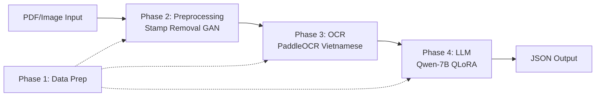

# OCR-LLM Research System - Walkthrough

## Tổng quan

Đã xây dựng **5 Python notebooks** (Colab-compatible) cho hệ thống trích xuất thông tin tự động từ văn bản hành chính tiếng Việt.

## Kiến trúc Pipeline



## Files đã tạo

| File | Mô tả |
|---|---|
| [Phase1_Data_Preparation.py](file:///e:/OCR-LLM_Research/notebooks/Phase1_Data_Preparation.py) | Trích xuất stamp từ PDF, tạo synthetic stamps, chuyển docx→image, tạo LLM dataset |
| [Phase2_Stamp_Removal_GAN.py](file:///e:/OCR-LLM_Research/notebooks/Phase2_Stamp_Removal_GAN.py) | Pix2Pix GAN (U-Net Generator + PatchGAN) xóa con dấu đỏ |
| [Phase3_OCR_Engine.py](file:///e:/OCR-LLM_Research/notebooks/Phase3_OCR_Engine.py) | PaddleOCR cho tiếng Việt + đánh giá CER/WER |
| [Phase4_LLM_Finetuning.py](file:///e:/OCR-LLM_Research/notebooks/Phase4_LLM_Finetuning.py) | QLoRA fine-tuning Qwen-2.5-7B + inference + evaluation F1 |
| [Phase5_End_to_End_Pipeline.py](file:///e:/OCR-LLM_Research/notebooks/Phase5_End_to_End_Pipeline.py) | Pipeline tích hợp + FastAPI web service |
| [requirements.txt](file:///e:/OCR-LLM_Research/requirements.txt) | Tất cả dependencies |

## Cách chạy trên Google Colab

### Bước 1: Upload data lên Google Drive
```
Google Drive/
└── OCR-LLM_Research/
    └── data/
        ├── raw_word_files/   (2000 docx)
        └── test/             (150 PDFs)
```

### Bước 2: Mở từng notebook theo thứ tự
1. Upload file [.py](file:///e:/OCR-LLM_Research/notebooks/Phase3_OCR_Engine.py) lên Colab hoặc copy nội dung vào notebook mới
2. Uncomment dòng `drive.mount()` và `BASE_DIR = "/content/drive/..."`
3. Comment dòng `BASE_DIR = r"E:\OCR-LLM_Research"`
4. Chạy từng Cell theo thứ tự (xem hướng dẫn trong từng notebook)

### Thứ tự chạy
1. **Phase 1** → Tạo stamps + training data + LLM dataset
2. **Phase 2** → Train GAN xóa dấu (cần GPU, ~2-3 giờ)
3. **Phase 3** → Chạy OCR trên 150 PDFs
4. **Phase 4** → Fine-tune Qwen-7B (cần GPU T4+, ~1-2 giờ)
5. **Phase 5** → Test end-to-end pipeline

## Tận dụng dữ liệu hiện có

| Dữ liệu | Vai trò |
|---|---|
| **2000 docx** | Ground truth cho OCR + instruction dataset cho LLM fine-tuning + clean images cho GAN |
| **150 PDFs** | Trích xuất stamps thật + benchmark testing |
| **Synthetic stamps** | Training data cho Pix2Pix GAN (tạo bằng code, không cần thu thập thủ công) |

## Next Steps
- [ ] Upload data lên Google Drive
- [ ] Chạy Phase 1 trên Colab để tạo dữ liệu
- [ ] Chạy Phase 2-4 để train models
- [ ] Test end-to-end trên 150 PDFs
